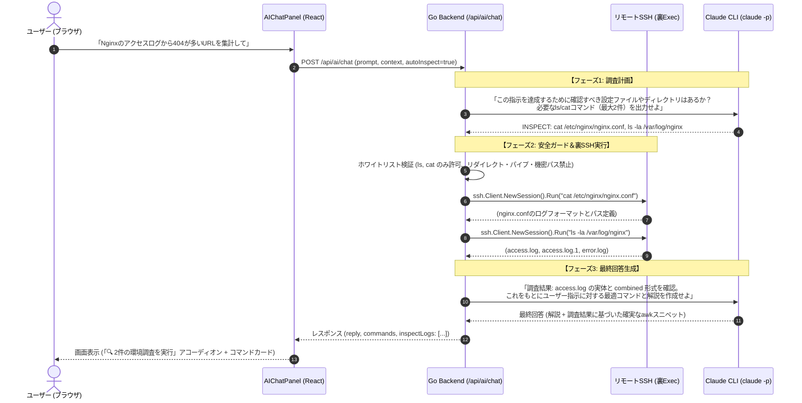

# 🔍 Feature 06: AI自律環境調査 (Safe Read-Only Inspection) & 汎用チャット応答

> **セッション目的**: 
> 1. AI（Claude）に安全な読み取り専用コマンド（`ls`, `cat`, `head` 等）の実行だけを許可し、**実際のOSや設定ファイルの中身を裏で自律調査した上で、環境に完全マッチしたコマンドスニペットを提案**できるようにする。
> 2. コマンド生成だけでなく、**Linux/運用の概念質問やトラブルシューティングの相談に自然に応答**できる柔軟なチャットアシスタントに拡張する。

---

## 💡 ユーザー体験と処理フロー



---

## 🛡️ 安全性ガードレール（ホワイトリスト仕様）

本番機での安全性を100%担保するため、AIによる自動実行は以下の**厳格な安全基準**を満たすものだけに制限します：

### 1. 許可コマンド（ホワイトリスト）
- `ls`（`-l`, `-a`, `-h`, `-t` 等の表示オプション＋パス）
- `cat`（指定テキストファイル）
- `head`, `tail`（`-n <行数>` による件数指定）
- `grep`（`-i`, `-n`, `-v` 等の読み取りオプション＋パターン＋ファイル）
- `which`, `command -v`
- `uname`（`-a`, `-r`）
- `cat /etc/*release`, `cat /etc/issue`

### 2. 絶対禁止パターン（即座に拒絶）
- 書き込み・追記リダイレクト: `>`, `>>`
- パイプライン: `|`（危険なコマンドへの引き渡しを防止）
- コマンド連鎖・置換: `;`, `&&`, `||`, `` ` ``, `$()`
- 機密ファイルへのアクセス遮断:
  - `*shadow*`, `*passwd*`
  - `*id_rsa*`, `*id_ed25519*`, `*.pem`, `*.key`
  - `*credentials*`, `*.env`
- 実行ユーザーの制限: root昇格コマンド（`sudo`, `su`）は自動実行不可

### 3. リソース保護
- **タイムアウト**: 1コマンド最大 5 秒
- **出力サイズ上限**: 最大 16KB（超えた場合は先頭部分で切り詰め、OOMやコンテキスト溢れを防止）

---

## 💬 汎用チャット応答の柔軟化

現状はプロンプトで「必ず ```bash ... ``` でコマンドを提示せよ」と強制しているため、挨拶や概念質問でも無理やりコマンドを出そうとしてしまいます。

### プロンプト改定ルール
```markdown
- ユーザーが操作・調査・実行コマンドを求めている場合は、最適なコマンドを ```bash ... ``` で提示してください。
- ユーザーが概念の解説、仕組みの質問、トラブルの考察、壁打ちや相談を行っている場合は、無理にコマンドブロックを作成せず、通常の親切なMarkdownテキストで回答してください。
- 設定ファイル（nginx.conf, yaml, json等）の例を提示する場合は、それぞれの言語名（```nginx, ```yaml）を使用してください（コマンドバーには送られません）。
```

---

## 🏗️ 変更対象ファイル一覧（次セッション）

### バックエンド (Go)
- `internal/ai/service.go`:
  - `InspectAndChat`: 2ステップ調査パイプライン（調査計画 -> 安全実行 -> 最終回答）の実装
  - `ValidateSafeCommand`: ホワイトリスト＆禁止パターン正規表現バリデーション
- `internal/ai/types.go`:
  - `InspectLog`（実行した調査コマンドと取得結果のサマリー構造体）
  - `ChatRequest` に `AutoInspect bool` オプション追加
- `internal/api/handler.go`:
  - `handleAIChat` にセッションの `ssh.Client` を安全に渡す連携

### フロントエンド (React / TypeScript)
- `frontend/src/components/AIChatPanel.tsx`:
  - 「🔍 自動環境調査（ls/cat許可）」トグルスイッチ
  - 調査ログのアコーディオン表示（「🔍 2件の環境確認を実行しました」）
  - コマンドブロックがない場合の自然なMarkdown描画対応
- `frontend/src/types/index.ts`:
  - `InspectLog` 型定義

---

## 🧪 検証シナリオ

1. **自律調査の検証**:
   - 指示: 「Nginxのアクセスログから最新20件を表示して」
   - 挙動: AIが裏で `ls /var/log/nginx` または `cat /etc/nginx/nginx.conf` を実行し、実際のログファイル名（`access.log` 等）を特定した上で `tail -n 20 /var/log/nginx/access.log` を提案する。
2. **安全ガードの検証**:
   - AIが誤って `rm` や `cat > file`、`| sh` 等を要求した場合、Goバックエンドが即座にブロックして安全にスキップする。
3. **通常質問・壁打ちチャットの検証**:
   - 質問: 「systemdのタイマーとcronの違いを教えて」
   - 挙動: 無理なコマンドスニペットを出さず、分かりやすい比較解説文が返ってくる。
